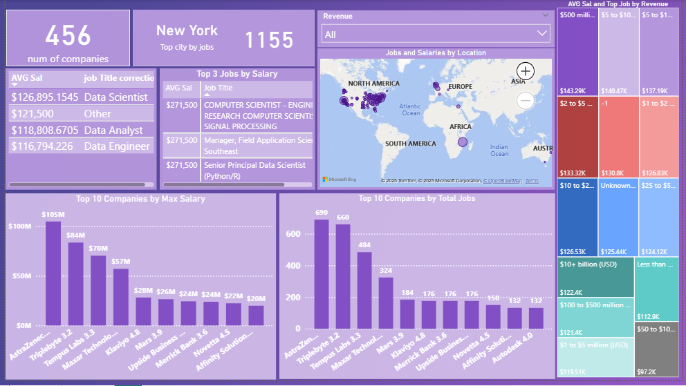

# 📊 Data Cleaning and Visualization Using Power BI

### 🔍 Project Overview
This project demonstrates the complete data preparation and visualization process for job market data.  
The main focus was on cleaning, transforming, and modeling the dataset using **Power Query** and **Power BI**, followed by creating an interactive dashboard.

---

### 🧰 Tools & Technologies
- **Power Query** (for data cleaning & normalization)  
- **Power BI** (for data modeling, DAX, and dashboard design)  
- **Excel / CSV** (as data source)

---

### 🧹 Data Preparation (Power Query)
Performed extensive cleaning and normalization steps:
- Removed unnecessary columns and fixed data types  
- Handled missing values and inconsistent formats  
- Normalized text data (company names, locations, etc.)  
- Split complex columns into separate meaningful fields  

---

### 🧩 Data Modeling (Power BI)
- Created relationships between tables for better analytical performance  
- Defined calculated columns and simple **DAX measures** (e.g., averages, counts)  
- Optimized model for faster visualization  

---

### 📈 Dashboard & Insights
Designed an interactive dashboard to explore:
- Average company ratings by industry and sector  
- Salary range distribution by job title  
- Job opportunities by location  
- Company size vs. revenue overview  

---

### Key Insights
Data Scientists have the highest average salary across companies.
New York has the highest number of job postings.
Large companies ($1B+) offer higher average salaries.

---

### 💡 Key Takeaways
- Strengthened understanding of **data cleaning** and **data modeling workflow**  
- Built practical skills in **Power Query**, **DAX**, and **visual storytelling with Power BI**

---

## Dashboard Preview

